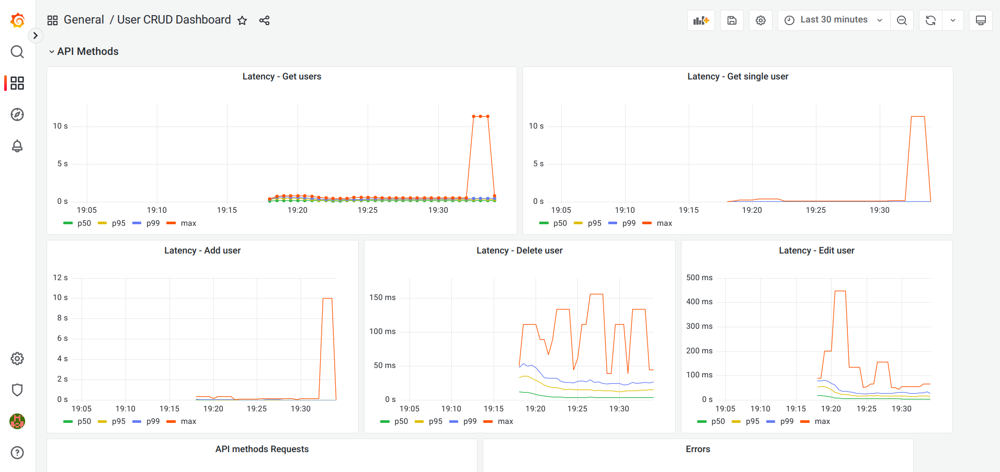
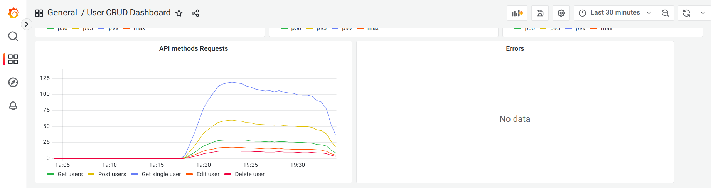
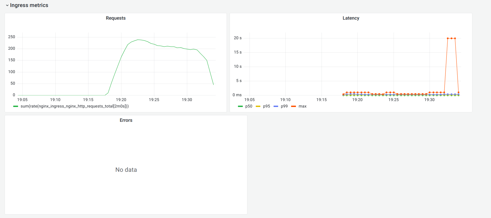
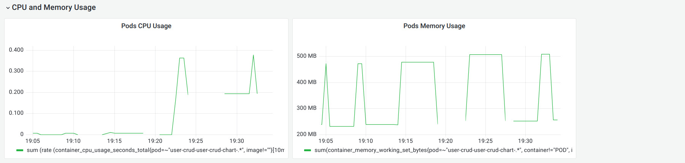

# ДЗ 3. Prometheus и Grafana

Для выполнения этого задания я установил Prometheus в свой кластер в minikube:

```
helm install --set prometheus.prometheusSpec.serviceMonitorSelectorNilUsesHelmValues=false prometheus.prometheusSpec.podMonitorSelectorNilUsesHelmValues=false prometheus prometheus-community/kube-prometheus-stack
```

Чтобы выполнить часть, касающуюся получения метрик с ингресса, пришлось отключить встроенный в minikube аддон для ингресса и установить ингресс вручную:

```
helm install --set prometheus.create=true --set controller.enableLatencyMetrics=true nginx nginx-stable/nginx-ingress
```

Чтобы ингресс заработал, понадобилось также включить в minikube аддон `metallb` и прописать в его ConfigMap в настройках address-pools.addresses ip-адрес minikube.

Чтобы Prometheus получал метрики с ингресса, использовался дополнительный файл с настройками `nginx-podmonitor.yaml`.

Приложение, как и в предыдущей работе, устанавливается из helm-чарта из директории `../user-crud-chart`.

Созданный dashboard для Графаны находится в файле `graphana-dashboard.json`.

Нагрузочное тестирование проводилось с помощью утилиты [Apache JMeter](https://jmeter.apache.org/), тестовый скрипт 
находится в файле `test.jmx`.

Скриншоты после тестирования. Метрики с приложения:




Метрики с ингресса:



Метрики CPU и памяти:


